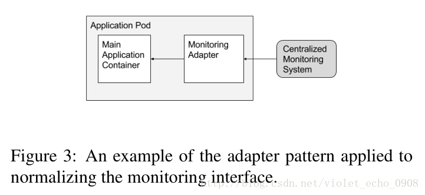

author:            zhengjiajin
summary:           kubernetes 开发快速入门
id:                kubernetes
categories:        kubernetes
status:            draft
analytics account: 0

# kubernetes 开发快速入门

## 个人介绍

姓名: 郑佳金

github ID: https://github.com/zjj2wry/

工作经历：2016 ~ now

- kubernetes 开源
- Kubernetes 二次开发，多租户、资源管理、authn、authz、存储、ingress
- tensorflow on kubernetes

爱好: 篮球、lol

## Kubernetes 介绍

#### 架构


#### pod 的设计

kubernetes pod 的设计是一个复合容器，多个容器会跑在一起作为一个 pod 调度到节点上。同一个 pod 的容器共享网络和存储。

##### Sidecar pattern


##### 

##### Ambassador pattern


##### Adapter pattern



#### create 一个 rs 的流程


## 搭建本地开发环境

### 拷贝 kubernetes 代码

```bash
cd $GOPATH/src
mkdir k8s.io
cd k8s.io
git clone git@github.com:kubernetes/kubernetes.git --depth=1
Cloning into 'kubernetes'...
remote: Enumerating objects: 21946, done.
remote: Counting objects: 100% (21946/21946), done.
remote: Compressing objects: 100% (18065/18065), done.
remote: Total 21946 (delta 7522), reused 9318 (delta 3326), pack-reused 0
Receiving objects: 100% (21946/21946), 28.12 MiB | 396.00 KiB/s, done.
Resolving deltas: 100% (7522/7522), done.
Checking out files: 100% (19136/19136), done.
```

### 编译 k8s 源码并在本地启动 k8s 集群
安装 etcd
```bash
hack/install-etcd.sh
```
安装 cfssl，k8s 的各个组件使用证书通信
```bash
brew install cfssl
```
编译 k8s 源码并启动集群
```bash
hack/local-up-cluster.sh
...
Local Kubernetes cluster is running. Press Ctrl-C to shut it down.
```
使用编译好的 kubectl 访问集群，通过 `-v` flag 可以查看完整的请求过程
```bash
export KUBECONFIG=/var/run/kubernetes/admin.kubeconfig
cluster/kubectl.sh cluster-info -v 8
I0617 11:37:11.472294   79798 loader.go:359] Config loaded from file:  /var/run/kubernetes/admin.kubeconfig
I0617 11:37:11.490024   79798 round_trippers.go:416] GET https://localhost:6443/api/v1/namespaces/kube-system/services?labelSelector=kubernetes.io%2Fcluster-service%3Dtrue
I0617 11:37:11.490056   79798 round_trippers.go:423] Request Headers:
I0617 11:37:11.490066   79798 round_trippers.go:426]     Accept: application/json, */*
I0617 11:37:11.490076   79798 round_trippers.go:426]     User-Agent: kubectl/v0.0.0 (darwin/amd64) kubernetes/8f4cc7d
I0617 11:37:11.505658   79798 round_trippers.go:441] Response Status: 200 OK in 15 milliseconds
I0617 11:37:11.505747   79798 round_trippers.go:444] Response Headers:
I0617 11:37:11.505775   79798 round_trippers.go:447]     Content-Type: application/json
I0617 11:37:11.505793   79798 round_trippers.go:447]     Content-Length: 792
I0617 11:37:11.505807   79798 round_trippers.go:447]     Date: Mon, 17 Jun 2019 03:37:11 GMT
I0617 11:37:11.505900   79798 request.go:947] Response Body: {"kind":"ServiceList","apiVersion":"v1","metadata":{"selfLink":"/api/v1/namespaces/kube-system/services","resourceVersion":"279"},"items":[{"metadata":{"name":"kube-dns","namespace":"kube-system","selfLink":"/api/v1/namespaces/kube-system/services/kube-dns","uid":"b1098b28-d135-4ab1-aadb-1a3a29e2387a","resourceVersion":"150","creationTimestamp":"2019-06-17T03:34:32Z","labels":{"addonmanager.kubernetes.io/mode":"Reconcile","k8s-app":"kube-dns","kubernetes.io/cluster-service":"true","kubernetes.io/name":"KubeDNS"}},"spec":{"ports":[{"name":"dns","protocol":"UDP","port":53,"targetPort":53},{"name":"dns-tcp","protocol":"TCP","port":53,"targetPort":53}],"selector":{"k8s-app":"kube-dns"},"clusterIP":"10.0.0.10","type":"ClusterIP","sessionAffinity":"None"},"status":{"loadBalancer":{}}}]}
Kubernetes master is running at https://localhost:6443/
KubeDNS is running at https://localhost:6443//api/v1/namespaces/kube-system/services/kube-dns:dns/proxy
```

如果之前已经编译过二进制，只是想启动集群，使用 `-o` flag
```bash
hack/local-up-cluster.sh -o _output/dockerized/bin/linux/amd64/
```

## 项目结构

### kubernetes 主仓库的项目结构 

```bash
├── Godeps
├── _output
│   └── local
├── api
│   ├── api-rules
│   └── openapi-spec
├── build	# 镜像文件
...
│   ├── pause # pause 可以看一下，k8s sidecar 机制实现需要用到的镜像
├── cluster # yaml 文件，集群启动的一些 addons
│   ├── addons
...
├── cmd # 各个组件的 main 入口
...
│   ├── hyperkube # hyperkube 包含了 k8s 所有的组件，hyperkube kube-apiserver == kube-aiserver
│   ├── kube-apiserver
│   ├── kube-controller-manager
│   ├── kube-proxy
│   ├── kube-scheduler
│   ├── kubeadm
│   ├── kubectl
│   ├── kubelet
├── docs
├── hack # 脚本文件，测试启动的脚本，codegen 相关的脚本
...
├── logo
├── pkg
│   ├── api
│   ├── apis # internal version 的 API 结构体
│   ├── auth # auth 相关的代码，不用理会，k8s authn、authz 相关代码主要在 kubernetes/apiserver
│   ├── capabilities
│   ├── client
│   ├── cloudprovider # 外部云提供商
│   ├── controller # *k8s 原生controller 的代码*
│   ├── credentialprovider # 外部云提供商证书相关
│   ├── features # * feature getes，开启和关闭功能，新增的功能都要在这里测试 gates
│   ├── fieldpath
│   ├── generated
│   ├── kubeapiserver # *apiserver 参数初始化和核心代码*
│   ├── kubectl # *kubectl 的核心代码*
│   ├── kubelet # *kubelet 的核心代码*
│   ├── kubemark
│   ├── master
│   ├── printers # kubectl get 和 describe 命令的代码
│   ├── probe
│   ├── proxy
│   ├── quota
│   ├── registry # 实现了 apiserver storage 的核心代码
│   ├── routes
│   ├── scheduler # *调度器相关的代码*
│   ├── security
│   ├── securitycontext
│   ├── serviceaccount
│   ├── ssh
│   ├── util
│   ├── version
│   ├── volume # *volume 接口的实现*
│   ├── watch
│   └── windows
├── plugin
│   └── pkg
├── staging # *staging 目录放了 client-go apimachinery 等等通用仓库相关的代码*
│   ├── publishing
│   └── src
├── test # 测试代码
...
├── third_party
├── translations # kubectl 国际化的翻译
└── vendor
```

### 核心的 lib

因为 k8s 很多 lib 会被开发者引用，所以 k8s 把核心的 lib 放到了一下四个仓库，在做二次开发的时候不要直接去引用 k8s 主仓库的代码

- [apimachinery](https://github.com/kubernetes/apimachinery): Scheme, typing, encoding, decoding, and conversion packages for Kubernetes and Kubernetes-like API objects

  

- [client-go](https://github.com/kubernetes/client-go)：Go clients for talking to a kubernetes cluster
  
  - informer：二级缓存，注册事件的回调函数，list-watch k8s resources
  - Lister: 从缓存中 list 和 get 数据
  - clientset、dynamic client：k8s API 的 client
  - workqueue：k8s controller 会先把事件放到队列中处理
    - 避免一个事件被处理多次，同一个对象被 enqueue 多次，dequeue 只会出现一次
    - 多线程并发处理
    - ratelimit queue 避免 hot-loop 等等
    - 失败可以重新入队，保证状态最终一致
    
    
  
- [api](https://github.com/kubernetes/api): Schema of the external API types that are served by the Kubernetes API server.

- [apiserver](https://github.com/kubernetes/apiserver): Library for writing a Kubernetes-style API server.


## 使用 client-go 操作 kubernetes resource

### 3 种 client

#### clientset
```go
clientset.AppsV1().Deployments(apiv1.NamespaceDefault).Get("demo-deployment", metav1.GetOptions{})
```
使用的最多的 client，使用非常简单 `GroupVersion().Resources().Ops()`，只支持 json 序列化

#### dynamic client

```go
got, err := cl.Resource(resource).Namespace(tc.namespace).List(metav1.ListOptions{})
```
返回的是 map，通常会配合 API discovery 使用，只支持 json

#### restclient
```go
result = &v1beta2.Deployment{}
err = c.client.Get().
		Namespace(c.ns).
		Resource("deployments").
		Name(name).
		VersionedParams(&options, scheme.ParameterCodec).
		Do().
		Into(result)
```

支持 protobuf 和json 序列化，clientset 和 dynamic client 都是基于这个实现的

### options
#### Get
```go
// GetOptions is the standard query options to the standard REST get call.
type GetOptions struct {
...
	// When specified:
	// - if unset, then the result is returned from remote storage based on quorum-read flag;
	// - if it's 0, then we simply return what we currently have in cache, no guarantee;
	// - if set to non zero, then the result is at least as fresh as given rv.
	ResourceVersion string `json:"resourceVersion,omitempty" protobuf:"bytes,1,opt,name=resourceVersion"`
	// +k8s:deprecated=includeUninitialized,protobuf=2
}
```
resource version

- 如果不设置会直接从 etcd 读取

- 如果设置为 0 会从 apiserver 的缓存去读

- 设置为其他值会等对象的 resource version大于所设置的值，如果设置的很大会出现 timeout

#### List

```go
// ListOptions is the query options to a standard REST list call.
type ListOptions struct {
	// A selector to restrict the list of returned objects by their labels.
	// Defaults to everything.
	// +optional
	LabelSelector string `json:"labelSelector,omitempty" protobuf:"bytes,1,opt,name=labelSelector"`
	// A selector to restrict the list of returned objects by their fields.
	// Defaults to everything.
	// +optional
	FieldSelector string `json:"fieldSelector,omitempty" protobuf:"bytes,2,opt,name=fieldSelector"`
	// When specified with a watch call, shows changes that occur after that particular version of a resource.
	// Defaults to changes from the beginning of history.
	// When specified for list:
	// - if unset, then the result is returned from remote storage based on quorum-read flag;
	// - if it's 0, then we simply return what we currently have in cache, no guarantee;
	// - if set to non zero, then the result is at least as fresh as given rv.
	// +optional
	ResourceVersion string `json:"resourceVersion,omitempty" protobuf:"bytes,4,opt,name=resourceVersion"`
}
```

##### LabelSelector

list 的过滤条件，可以为你的资源打上指定的标签来过滤

##### FieldSelector

支持的功能较少，代码在 apiserver 是 hardcode的

> kubectl get 支持 LabelSelector 和 FieldSelector 查询
>
> --field-selector='': Selector (field query) to filter on, supports '=', '==', and '!='.(e.g. --field-selector
> key1=value1,key2=value2). The server only supports a limited number of field queries per type.
>
> -l, --selector='': Selector (label query) to filter on, supports '=', '==', and '!='.(e.g. -l key1=value1,key2=value2)

#### Watch

watch 也可以指定 resourceVersion，会从指定的 resourceVersion 开始去 watch 资源，在 informer 里面，一般都是先 list，把 resource version 设为 0，API Server 就可以从 cache 里面给我 list。List 完之后，把 list 的 resource version 取出来，并且设置为 watch 的 listOption，这样就可以保证 informer 拿到的 events 是连续的

https://github.com/kubernetes/kubernetes/blob/master/staging/src/k8s.io/client-go/tools/cache/reflector.go#L159~L312

#### Update

k8s 所有的对象都有一个版本号，为了做[乐观并发控制](https://zjj2wry.github.io/kubes/optimistic_concurrency_control/)，乐观并发控制就是认为在修改数据的时候会出现 race 的情况。k8s 的乐观并发控制是基于 cas 实现的，所以 update 操作通常也可以作为一个分布式锁来使用。通常在 update 前会先 get 拿到资源最新的 resourceVersion，然后修改其他信息后执行 update 操作。

#### Patch

和 update 一样都是更新资源，但是 patch 支持更新部分结构

#### Delete

```go
// DeleteOptions may be provided when deleting an API object.
type DeleteOptions struct {
...
	// Whether and how garbage collection will be performed.
	// Either this field or OrphanDependents may be set, but not both.
	// The default policy is decided by the existing finalizer set in the
	// metadata.finalizers and the resource-specific default policy.
	// Acceptable values are: 'Orphan' - orphan the dependents; 'Background' -
	// allow the garbage collector to delete the dependents in the background;
	// 'Foreground' - a cascading policy that deletes all dependents in the
	// foreground.
	// +optional
	PropagationPolicy *DeletionPropagation `json:"propagationPolicy,omitempty" protobuf:"varint,4,opt,name=propagationPolicy"`
}
```

DeletionPropagation

- orphan： 删除 owner，依赖项不处理，成为孤儿

- Background： 在后台删除依赖项，比如删除 deployment，deployment 会立刻被删除，然后后台再删 rs，最终被回收

- Foreground：依赖项被删除后再删除 owner 资源

  

> kubectl delete 可以通过 —cascade 指定删除策略
>
> --cascade=true: If true, cascade the deletion of the resources managed by this resource (e.g. Pods created by a ReplicationController).  Default true.

### [example](https://github.com/kubernetes/client-go/tree/master/examples)

> 可以安装 [minikube](https://kubernetes.io/docs/tasks/tools/install-minikube/) 来运行这些 example

- in cluster：你的程序运行在集群内部，这个时候的认证方式会走 service account 的流程，你对集群的权限取决于你的 service account 的权限
- out of cluster：需要提供 kubeconfig 文件来访问 apiserver

```bash
➜  out-of-cluster-client-configuration git:(master) ✗ pwd
/Users/zhengjiajin/go/src/k8s.io/kubernetes/staging/src/k8s.io/client-go/examples/out-of-cluster-client-configuration
➜  out-of-cluster-client-configuration git:(master) ✗ go run main.go --kubeconfig=/Users/zhengjiajin/.kube/config
There are 9 pods in the cluster
Pod example-xxxxx in namespace default not found
```

## kubernetes controller 快速入门

### controller workflow


黄色的部分是用户在写 controller 需要做的事情

### namespace controller

1. 注册事件监听

   ```go
   	namespaceInformer.Informer().AddEventHandlerWithResyncPeriod(
   		cache.ResourceEventHandlerFuncs{
   			AddFunc: func(obj interface{}) {
   				namespace := obj.(*v1.Namespace)
   				namespaceController.enqueueNamespace(namespace)
   			},
   			UpdateFunc: func(oldObj, newObj interface{}) {
   				namespace := newObj.(*v1.Namespace)
   				namespaceController.enqueueNamespace(namespace)
   			},
   		},
   		resyncPeriod,
   	)
   ```

2. Process item

   ```go
   func (nm *NamespaceController) worker() {
   	workFunc := func() bool {
   		key, quit := nm.queue.Get()
   		if quit {
   			return true
   		}
   		defer nm.queue.Done(key)
   
   		err := nm.syncNamespaceFromKey(key.(string))
   		if err == nil {
   			// no error, forget this entry and return
   			nm.queue.Forget(key)
   			return false
   		}
   
   		if estimate, ok := err.(*deletion.ResourcesRemainingError); ok {
   			t := estimate.Estimate/2 + 1
   			klog.V(4).Infof("Content remaining in namespace %s, waiting %d seconds", key, t)
   			nm.queue.AddAfter(key, time.Duration(t)*time.Second)
   		} else {
   			// rather than wait for a full resync, re-add the namespace to the queue to be processed
   			nm.queue.AddRateLimited(key)
   			utilruntime.HandleError(err)
   		}
   		return false
   	}
   
   	for {
   		quit := workFunc()
   
   		if quit {
   			return
   		}
   	}
   }
   ```

3. sync handle

   ```go
   func (nm *NamespaceController) syncNamespaceFromKey(key string) (err error) {
   	startTime := time.Now()
   	defer func() {
   		klog.V(4).Infof("Finished syncing namespace %q (%v)", key, time.Since(startTime))
   	}()
   
   	namespace, err := nm.lister.Get(key)
   	if errors.IsNotFound(err) {
   		klog.Infof("Namespace has been deleted %v", key)
   		return nil
   	}
   	if err != nil {
   		utilruntime.HandleError(fmt.Errorf("Unable to retrieve namespace %v from store: %v", key, err))
   		return err
   	}
   	return nm.namespacedResourcesDeleter.Delete(namespace.Name)
   }
   ```

### [best practices](https://github.com/kubernetes/community/blob/8decfe4/contributors/devel/controllers.md)

```
for {
  desired := getDesiredState()
  current := getCurrentState()
  makeChanges(desired, current)
}
```

1. resyncPeriod 通常设置为 0，周期性的把 cache 中的数据重新 enqueue
```go
Informer().AddEventHandlerWithResyncPeriod(_,resyncPeriod)
```
2. 使用 lister 去执行 list 和 get 操作, 减少对 apiserver 的直接访问

```go
controller.lister.Get(key)
```

3. 使用 [shareInformer](https://github.com/kubernetes/kubernetes/blob/master/staging/src/k8s.io/client-go/informers/factory.go) 共享缓存
4. 不要直接更新缓存的数据，而是使用 deepcopy 先拷贝数据
```
object.DeepCopy()
```

5. 使用 owner reference 或者 finalizer 处理资源回收问题
   1. owner reference 表示资源属于谁，比如 pod 属于 deployment，那么在 deploy 删除的时候，pod 会自动被 k8s 的 gc 回收
   2. finalizer 是另一种异步回收机制，比如你的 controller 是创建了一个 vm，你想在删除 vm 的时候保证这个 vm 被删除，你可以先在 vm 上打一个标签，然后 controller 看到了这个标签就去删除 vm，删除了 vm 之后再移除这个标签，这样相当于有一个同步机制，vm 这个资源一定是在虚拟机真正被删除才从数据库中移除
6. sync handle 中一般最开始会先 get 这个 object 是否存在，不存在可以直接 forget 这个事件

## others

Custom resource define (crd)：k8s 自定义资源，用户可以创建自己的资源对象

Operator: 比如 tf-operator 就是写了一个 tfjob 的 crd，然后通过 informer 写自己的 controller 实现分布式训练

APIserver: 在 crd 之前自定义资源还有一个名字叫做 thirt party resource，后来改成了 custom resource define，最新的有一个叫 apiserver 的资源，其实和 custom resource define 是同一个东西，有一些性能上的优化，比如允许你去使用自己的 etcd 数据库等等

kubebuilder: 构建自定义 controller 的 sdk


## references

- [Borg, Omega, and
Kubernetes](https://static.googleusercontent.com/media/research.google.com/zh-CN//pubs/archive/44843.pdf)

- [The Distributed System ToolKit: Patterns for Composite Containers](https://kubernetes.io/blog/2015/06/the-distributed-system-toolkit-patterns/)

- [What is Kubernetes](https://kubernetes.io/docs/concepts/overview/what-is-kubernetes/)
